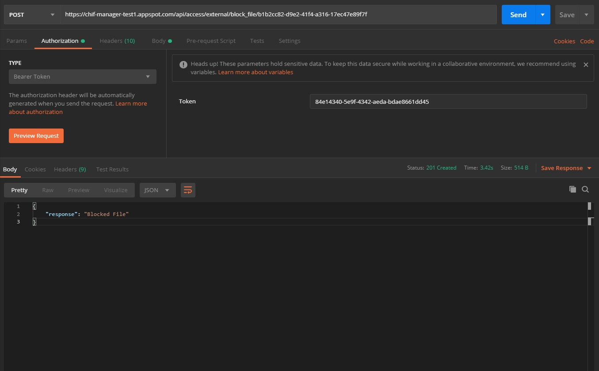

# CHIF Manager External API USAGE Docs

This is the working document for the Externally Accessible API

## Getting Started

These instructions will provide an overview of the API as well as step by step processes and examples for your convenience.

### Prerequisites

1. Understanding of [Bearer Token Authorization](https://swagger.io/docs/specification/authentication/bearer-authentication/)
2. Understanding of [HTTPS](https://en.wikipedia.org/wiki/Hypertext_Transfer_Protocol)
3. Download the [Postman](https://www.postman.com/) APP
4. Create or Access an Authorized [CHIF MANAGER](https://manager.c-hear.com) Account

### Authentication/Authorization via the Manager

#### Bearer Authentication

Bearer Authentication (also called Token Authentication) is an HTTP Authentication scheme that involves security tokens called bearer tokens. The name “Bearer authentication” can be understood as “give access to the bearer of this token.” The client must send this token in the Authorization header when making requests to protected resources:

The Manager External API utilizes Bearer tokens for user Authorization processing. All routes will require a Bearer token.

#### Bearer Token Management

After Creating an account with the [CHIF MANAGER](https://manager.c-hear.com), the token management system can be accessed via the [API](https://manager.c-hear.com/external_api) Page. Here you the user has access to your tokens, you can generate as many as required and delete them, these tokens are associated with the organization that they are created in.

During the creation process the user will provide token descriptor for personal identification.

#### Token Authorization Access

Not all tokens contain the same access as others, All tokens are associated to their parent organization and their payment plan, this determines the tokens ability to access certain features, ( !!! Has Not Deen Determined !!! )

### Accessible ENDPOINTS

Once you have token the world is your oyster!

Download the Following Postman Collection:

[](https://app.getpostman.com/run-collection/05ed2698fb9f65e502d4)

Open the collection and paste your token in the Authorization Tab - Type Bearer Token as seen below. Then Replace the necessary parameters for the specific endpoint as seen below.



Domain - [https://manager.c-hear.com](https://manager.c-hear.com)

| Method | Endpoint                       | Description           | Body              |
| ------ | ------------------------------ | --------------------- | ----------------- |
| POST   | `/api/access/external/encoder` | Creating a CHIF FILE. |                   |
| GET   | `/api/access/external/CHIF/metadata/:org_dir/:chif_file` | Receive the CHIF file's metadata content by providing the CHIF file name (name.chif) and the storage directory identifier in which the chif is located as http parameters. The storage directory identifier can be found under the manager library page - details tab. |                   |
| GET   | `/api/access/external/file_events/:uuid` | Receive the CHIF file's event content in csv format by providing the CHIF file uuid as a http parameter. The uuid can be found under the manager library page - details tab |                   |
| GET   | `/api/access/external/exception_file/:uuid` | Receive the CHIF file's Block description by providing the CHIF file uuid as a http parameter. The uuid can be found under the manager library page - details tab |                   |
| DELETE   | `/api/access/external/unblock_file/:uuid` | Remove the CHIF file's Block by providing the CHIF file uuid as a http parameter. The uuid can be found under the manager library page - details tab |                   |
| POST   | `/api/access/external/block_file/:uuid` | Remove the CHIF file's Block by providing the CHIF file uuid as a http parameter and a body with two key pairs, code and reason, these are both string values self determined by the user. The uuid can be found under the manager library page - details tab | ```{code: string, reason: string}``` |
